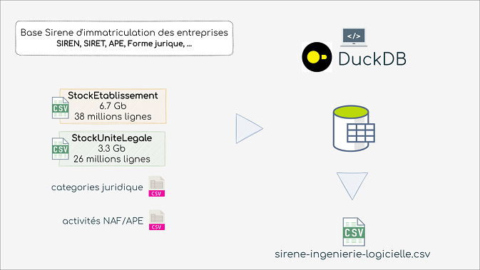

# Ingestion automatisée des fichiers stock de la base INSEE Sirene des entreprises avec DuckDB



- **Dockerfile**
  - Création d'une image Docker basée sur debian:stable-slim et copie du script sirene-duckdb.sh

- **sirene-duckdb.sh**
  - Téléchargement et décompactage de la [CLI DuckDB](https://duckdb.org/docs/installation/index?version=latest&environment=cli&installer=binary&platform=linux)

  - Téléchargement et décompactage des fichiers **StockEtablissement** et **StockUniteLegale** depuis [data.gouv](https://www.data.gouv.fr/fr/datasets/base-sirene-des-entreprises-et-de-leurs-etablissements-siren-siret/) dans le dossier ./sirene

  - NB: si les les fichiers StockEtablissement_utf8.csv et StockUniteLegale_utf8.csv sont déjà présents dans le conteneur (dossier ./sirene), les fichiers ne sont pas téléchargés. Pour forcer un nouveau téléchargement (les fichiers sont publiés le 1er de chaque mois sur data.gouv), supprimer les fichiers avant lancer l'éxecution du conteneur.

  - Execution du script SQL **./sql/extract-export.sql** avec la ligne de commande DuckDB

- **extract-export.sql**

  - Import des nomenclatures **./nomenclatures/activite.csv** et **./nomenclatures/cj.csv**
  - JOIN entre les deux fichiers CSV et les nomenclatures
  - Filtrage des enregistrements et export du résultat dans un fichier **./export/sirene-ingenierie-logicielle.csv**

```bash
#!/bin/bash

# Execution
docker-compose build
docker-compose up -d

```
